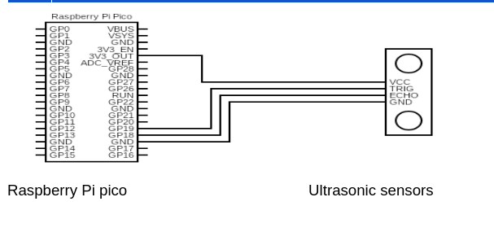
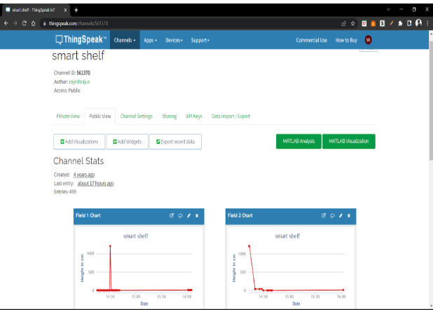
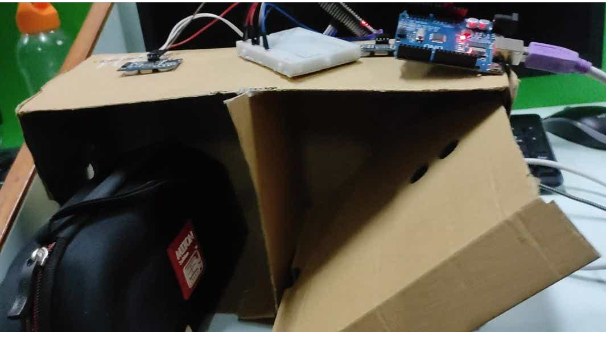
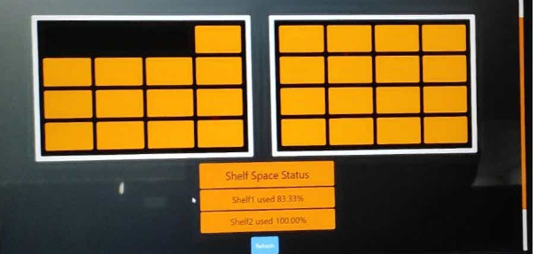
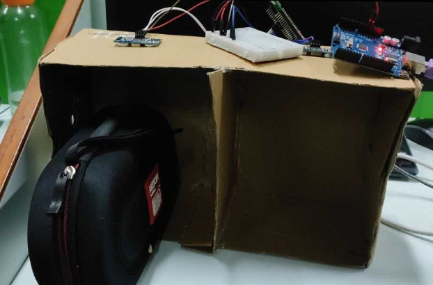
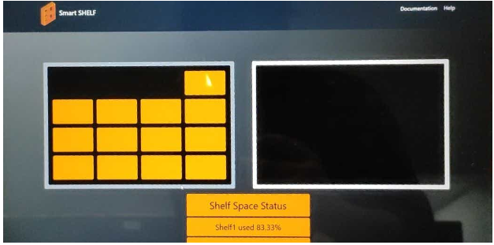

<!DOCTYPE html>
<html lang="en">
<head>
</head>
<body>
<h1>Circuit Diagram</h1>

<h2>Tools used</h2>
<ul>
    <li><b>Boards and Hardware: </b>
    <ol><li>Wiznet board</li>
    <li>Ultrasonic sensor</li>
    <li>Jumper wires</li>
        <li>Bread board</li></li></ol>
    <li><b>Frontend: </b>html, css, javascript</li>
    <li><b>Platform: </b>ThingSpeak</li>
</ul>
<h1>Screenshot</h1>
    
    
    
    
    
</body>
</html>

